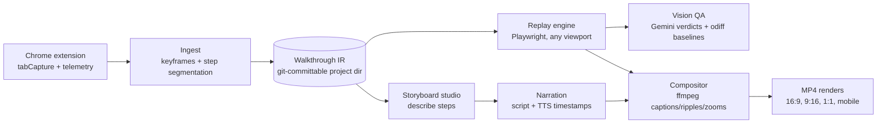

# Waggle

[](https://github.com/legioncodeinc/wagglereplay/actions/workflows/ci.yml)
[](./LICENSE)

Records a walkthrough of your web app once, then regenerates polished, narrated demo and training videos from it forever: any aspect ratio, any branding, re-rendered on demand as your app changes.

> Named for the waggle dance: how a bee shows the rest of the hive the exact route to something worth visiting.

**Status: alpha, usable end to end from source.** The full capture-to-render pipeline is built and tested (PRDs 001 through 010): the extension records, ingest produces a Walkthrough IR, Studio reviews and describes steps, narration synthesizes with word timestamps, the compositor renders branded MP4s, replay regenerates them at any preset, and credentials are masked out of every artifact. The zero-terminal desktop app (PRD-018, Electron) is fully planned and not yet built; until it ships, you drive Waggle from the Chrome extension plus Studio, with the CLI for scripted use.

## What it is

Waggle is an open source, local-first toolchain with three parts: a Chrome extension that records a walkthrough as pixels plus structured telemetry (every click, mouse move, route change, and the exact element touched), a storyboard studio where you describe each step and an AI drafts the narration, and a render engine that deterministically replays the walkthrough in Playwright at any viewport and composites the final video with ffmpeg (captions, click ripples, zooms, watermarks, your narration audio).

The recording is not the asset. The **Walkthrough IR** (a git-committable JSON action timeline) is. Videos are cheap derivatives you regenerate at will: demo-as-code.

## Why it exists

Every existing tool in this space freezes pixels at capture time, so a UI change means re-recording, a vertical cut means a dumb center crop, and a rebrand means starting over. Waggle keeps the walkthrough as replayable data, which makes regeneration, true multi-aspect re-renders, and CI-triggered video updates possible. Nobody offered that, so it is being built here, in the open, primarily because the author wants it for his own projects.

## The human path (recommended)

Per ADR-019 the graphical flow is the primary interface; the CLI exists for scripted use and CI:

1. `waggle studio` boots the local Studio editor for your project (loopback, default port 4310).
2. Load the unpacked capture extension in Chrome (`apps/extension`), start a recording from its toolbar action, and walk your app.
3. The extension uploads the capture session to Studio; review the storyboard, describe steps, approve narration.
4. `waggle narrate` then `waggle render` (or the Studio flow) produce the MP4s.
5. When your app changes, `waggle regen` re-replays the IR against the live app and re-renders every preset.

## Quick start

```bash
corepack enable
pnpm install
pnpm build
pnpm --filter @waggle/cli start init my-demo
pnpm --filter @waggle/cli start studio --project my-demo
```

`waggle` is not published to npm yet; run it through the workspace as above (shortened to `waggle <command>` in the examples). See [packages/cli/README.md](./packages/cli/README.md) for the full command table and the exit-code reference.

## Install

Prerequisites:

- Node.js 24 or newer (see `.nvmrc`)
- pnpm 11+ (via `corepack enable`)
- ffmpeg 7+ on PATH (or `WAGGLE_FFMPEG_PATH`)
- Chrome (sideload the capture extension from `apps/extension` during alpha)

## Usage

Core loop, all commands implemented today:

```bash
waggle studio                                  # boot the local Studio editor (recommended human path)
waggle record --session <dir>                  # scripted path: ingest a finished capture session into an IR version
waggle narrate                                 # draft the script, then synthesize voice with word timestamps after approval
waggle render --preset 16x9 --preset 9x16      # composite branded MP4s at any preset
waggle regen                                   # re-replay against the live app after it changed, re-render all presets
waggle export                                  # self-contained share bundle, optional R2 upload
waggle creds check                             # verify credential env refs resolve; never prints values
waggle clean                                   # prune old renders, dry-run by default
```

Demo credentials for the recorded app are declared as environment-variable references only (ADR-008); Waggle masks them at fill time, in screenshots, and in every prompt that leaves the process.

## Configuration

All configuration is environment variables, documented in [.env.example](./.env.example). Bring your own API keys (ElevenLabs for voice by default; an LLM key for optional AI-drafted descriptions; Gemini for vision QA later). Secrets never enter walkthrough project files. `waggle creds check` reports which declared refs resolve on your machine without ever printing values.

## Architecture



Decisions are recorded as ADRs in [library/knowledge/private/architecture/](./library/knowledge/private/architecture/); the build plan lives in [library/requirements/](./library/requirements/) as 19 PRDs across 4 phases (001 through 010 shipped, in `completed/`).

## Development

```bash
git clone https://github.com/legioncodeinc/wagglereplay.git
cd wagglereplay
corepack enable && pnpm install
pnpm build       # needed before pnpm test: the studio-command tests boot the built server
pnpm lint        # biome ci .
pnpm typecheck   # tsc --noEmit per package, svelte-check for apps/studio
pnpm test        # vitest per package
```

The workspace uses [Biome](https://biomejs.dev) rather than ESLint+Prettier:
one dependency, one config file (`biome.json`), and a Rust-native linter fast
enough to run in `biome ci` (no auto-fix) on every push without slowing CI
down; `biome check --write .` is the local/pre-commit auto-fix command.

The E2E suites run real Chromium and real ffmpeg and are separate from `pnpm test`:

```bash
pnpm --filter @waggle/replay e2e
pnpm --filter @waggle/studio e2e
pnpm --filter @waggle/extension e2e
```

## Testing

`pnpm test` covers the unit suites (764 tests at last count). The three E2E suites above are the seam proofs: real replay-to-compose renders, the built Studio server, and extension registration and alignment. CI runs lint, typecheck, tests, and CodeQL on every PR.

## Deployment

None: Waggle is local-first (ADR-014). An optional Cloudflare runner profile for CI video regeneration is planned in prd-012. Desktop installers for Windows and macOS are planned in prd-018.

## Contributing

Issues and PRs welcome. See [CONTRIBUTING.md](./CONTRIBUTING.md) for branching, Conventional Commits, and the review gate.

## License

Waggle is licensed under the [GNU AGPL-3.0](./LICENSE). Copyright (c) 2026 Legion Code Inc. Commercial licensing inquiries: mario@legioncodeinc.com.
