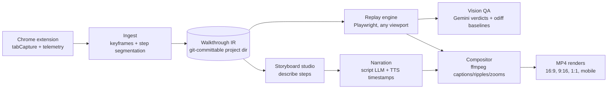

# Waggle

[](https://github.com/legioncodeinc/wagglereplay/actions/workflows/ci.yml)
[](./LICENSE)

Records a walkthrough of your web app once, then regenerates polished, narrated demo and training videos from it forever: any aspect ratio, any branding, re-rendered on demand as your app changes.

> Named for the waggle dance: how a bee shows the rest of the hive the exact route to something worth visiting.

**Status: pre-alpha.** The repository is currently a seeded planning library (ADRs, PRDs, knowledge corpus) ahead of implementation. Nothing runs yet.

## What it is

Waggle is an open source, local-first toolchain with three parts: a Chrome extension that records a walkthrough as pixels plus structured telemetry (every click, mouse move, route change, and the exact element touched), a storyboard studio where you describe each step and an AI drafts the narration, and a render engine that deterministically replays the walkthrough in Playwright at any viewport and composites the final video with ffmpeg (captions, click ripples, zooms, watermarks, your narration audio).

The recording is not the asset. The **Walkthrough IR** (a git-committable JSON action timeline) is. Videos are cheap derivatives you regenerate at will: demo-as-code.

## Why it exists

Every existing tool in this space freezes pixels at capture time, so a UI change means re-recording, a vertical cut means a dumb center crop, and a rebrand means starting over. Waggle keeps the walkthrough as replayable data, which makes regeneration, true multi-aspect re-renders, and CI-triggered video updates possible. Nobody offered that, so it is being built here, in the open, primarily because the author wants it for his own projects.

## Quick start

Not yet: pre-alpha. When prd-001 lands, this will be:

```bash
pnpm dlx waggle init my-demo && pnpm dlx waggle record
```

## Install

Prerequisites (planned):

- Node.js 24 or newer (see `.nvmrc`)
- pnpm 9+ (via `corepack enable`)
- ffmpeg 7+ on PATH
- Chrome (capture extension sideloaded during pre-alpha)

## Usage

Planned core loop:

```bash
waggle init my-demo        # scaffold a Waggle project directory
waggle record              # opens the studio, capture from the extension
waggle narrate             # script drafting + TTS with word timestamps
waggle render --preset 16x9 --preset 9x16
waggle regen               # re-replay + re-render after your app changed
```

## Configuration

All configuration is environment variables, documented in [.env.example](./.env.example). Bring your own API keys (ElevenLabs for voice by default; Gemini for optional vision QA). Secrets never enter walkthrough project files.

## Architecture



Decisions are recorded as ADRs in [library/knowledge/private/architecture/](./library/knowledge/private/architecture/); the build plan lives in [library/requirements/backlog/](./library/requirements/backlog/) as 17 PRDs across 4 phases.

## Development

```bash
git clone https://github.com/legioncodeinc/wagglereplay.git
cd wagglereplay
corepack enable && pnpm install   # once prd-001 lands
```

## Testing

```bash
pnpm test   # once prd-001 lands; CI guards keep the seeded repo green
```

## Deployment

None: Waggle is local-first (ADR-014). An optional Cloudflare runner profile for CI video regeneration is planned in prd-012.

## Contributing

Issues and PRs welcome once implementation starts. See [CONTRIBUTING.md](./CONTRIBUTING.md) for branching, Conventional Commits, and the review gate.

## License

Waggle is licensed under the [GNU AGPL-3.0](./LICENSE). Copyright (c) 2026 Legion Code Inc. Commercial licensing inquiries: mario@legioncodeinc.com.
