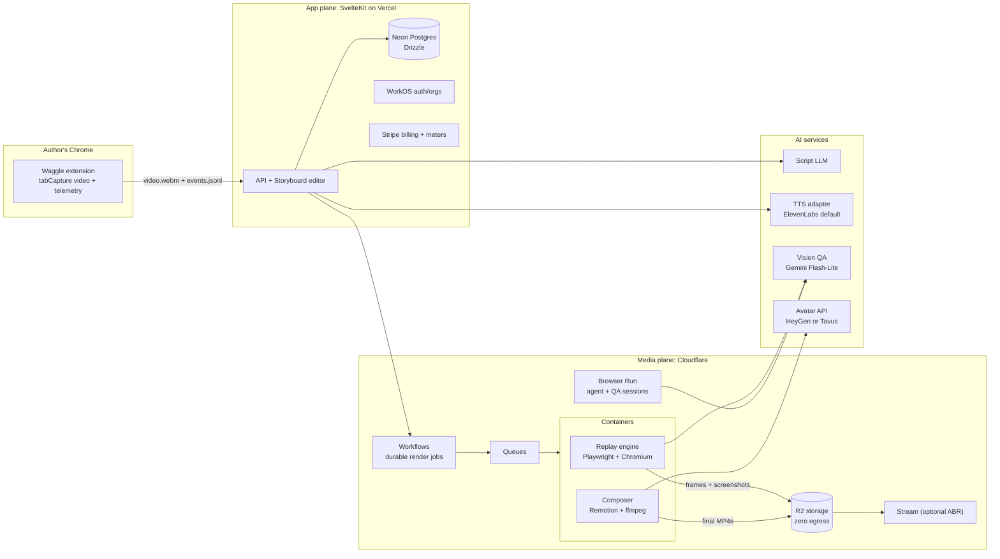

# Waggle Master Spec v0.1

Automated demo and training video platform. Working codename: **Waggle** (the waggle dance is how a bee shows the rest of the hive the exact route to something worth visiting; rename at will).

Prepared for Mario Aldayuz, Legion Code Inc. Date: 2026-08-20. Basis: five parallel research passes against primary sources (Chrome/CDP docs, Cloudflare docs, Playwright source, vendor pricing pages, GitHub repos). Every load-bearing claim carries its receipt inline. Decisions made per your answers: master spec + PRD map packaging, record-then-narrate MVP wedge, stack chosen from research and justified below.

---

## 0. Verdict: does the idea make sense?

Yes. Every capability you listed is buildable today with documented APIs, and the research turned up something better than feasibility: **the specific combination you described is a verified gap in the market.** Nine mainstream vendors (Clueso, Guidde, Trupeer, Arcade, Supademo, Storylane, Navattic, Tango, Floik) were profiled against their own pricing and docs pages, and none of them offer deterministic replay, true multi-aspect re-render, visual error detection during rendering, or per-end-customer white-label re-renders (section 1).

Three of your instincts need a reframe, though. Each reframe makes the product stronger, not weaker:

**Reframe 1: the recording is not the product; the action timeline is.** Every competitor freezes pixels at capture time, which is why none of them can re-render. If capture produces a structured, replayable **Walkthrough IR** (intermediate representation: selectors, coordinates, routes, timing, narration segments), then video becomes a cheap, disposable derivative you can regenerate at any aspect ratio, with any brand kit, any voice, any avatar, forever. "Capture once, render forever" is the moat, and it is exactly what a Supademo customer is publicly begging for with no product answer ([feedback.supademo.com](https://feedback.supademo.com/p/programmatically-create-supademos-via-apimcp)).

**Reframe 2: do not force the screen size at capture time.** Forcing viewport on a real user tab requires the `chrome.debugger` permission and `Emulation.setDeviceMetricsOverride`, which works ([CDP Emulation docs](https://chromedevtools.github.io/devtools-protocol/tot/Emulation/#method-setDeviceMetricsOverride)) but shows a persistent "started debugging this browser" infobar that detaches your session if the user dismisses it ([chrome.debugger docs](https://developer.chrome.com/docs/extensions/reference/api/debugger)), triggers the scariest install warning, and slows Chrome Web Store review ([permission warnings](https://developer.chrome.com/docs/extensions/reference/permissions-list), [review process](https://developer.chrome.com/docs/webstore/review-process)). Instead: record whatever viewport the author has (logging `innerWidth/innerHeight`, `devicePixelRatio`, and scroll offsets with every event) and force exact viewports later, server side, where Playwright sets them for free. Screen-size control belongs to the replay engine, not the extension.

**Reframe 3: never hunt for the click-highlight frame; synthesize it.** Because every click is captured with exact coordinates and an epoch-aligned timestamp, the highlight ripple, the storyboard frame, and the zoom-in are all rendered in post from data. The "frame of exactly when the pointer highlighter displayed" is guaranteed by construction, restylable per brand kit, and never missed. (This is also how Cap works internally: raw `cursor.json` event streams re-rendered at export with spring smoothing, per [Cap's cursor crate](https://github.com/CapSoftware/Cap/blob/main/crates/project/src/cursor.rs).)

One item is genuinely experimental: generating a video from uploaded audio alone with no user input (the agent must infer and execute the steps the narrator describes). It is phased last, behind the auto-drive and explorer work it depends on.

---

## 1. Market: what exists, what it costs, where the gaps are

Full profiles were pulled from vendor pricing/docs pages on 2026-08-20.

| Vendor | Capture | Re-render after edits? | Aspect ratios | AI voice | Avatar | API | Entry / team price |
|---|---|---|---|---|---|---|---|
| [Clueso](https://www.clueso.io/pricing) | Chrome ext, pixel video | Re-times on voice regen | Pixel crops only; own docs admit naive resize breaks comps | Yes + cloning | Yes (HeyGen-powered) | MCP only | $40/mo solo; $120/mo for 2 users |
| [Guidde](https://www.guidde.com/pricing) | Ext, step capture | Steps regen | **Locked at creation** ([help doc](https://help.guidde.com/en/articles/10657059-how-to-create-a-new-guidde-from-scratch)) | Business tier only | Add-on | None | $19 to $39/creator/mo |
| [Trupeer](https://trupeer.ai/pricing) | Ext, pixel + vision detection | Partial | Letterbox/crop reframe | Yes | +50 credits/min | None | $49/mo; $4/min top-up |
| [Arcade](https://www.arcade.software/pricing) | Ext + desktop, screenshots | Steps | Not offered | Yes | No | Enterprise only | $32 to $50/seat/mo |
| [Supademo](https://supademo.com/pricing) | Ext + desktop, screenshots | Steps | Not offered | Yes + cloning | No | Zapier triggers only | $38/creator; $350/mo growth |
| [Storylane](https://www.storylane.io/pricing) | Ext, HTML at $500 tier | Steps | Not offered | Yes | Minutes metered | Enterprise only | $40/seat; white-label URL at $1,500/mo |
| [Navattic](https://www.navattic.com/pricing) | Ext, HTML capture | Steps | Not offered | Yes | Minutes metered | None public | Opaque, annual only, ~$500/mo base |
| [Tango](https://www.tango.us/pricing) | Ext, screenshots | n/a | n/a | **None** | No | None | $15/user/mo (exited the video race) |
| [Floik](https://floik.com/pricing) | Ext, pixel | Partial | Not offered | Pro tier | Human PiP only | None | $39/mo (acquired by Kovai.co) |

Adjacent movers: [Videate](https://www.videate.io/) is the enterprise incumbent for auto-updating videos (code-level change detection, sales-gated, no self-serve, no white-label story). [Demosmith](https://demosmith.ai/) (beta) does prompt-to-agent-recorded video at roughly $2/min. [Clueso Agents](https://www.clueso.io/agents) (2026) re-records via a browser agent, enterprise book-a-demo only. A cluster of tiny OSS tools proves the deterministic-replay concept works ([auto_demo](https://github.com/wranngle/auto_demo), [demowright](https://github.com/matte97p/demowright), [demo-machine](https://github.com/45ck/demo-machine)) but none is a multi-tenant SaaS with a storyboard and voice pipeline.

**Verified gaps (nobody in the table offers these):**

1. **Deterministic replay so videos regenerate as the app changes.** All nine freeze pixels or screenshots at capture.
2. **True multi-aspect re-render.** The best on offer is cropping/letterboxing the original pixels; Guidde locks aspect at creation outright. Re-rendering the app itself at a different viewport requires replay, which nobody has.
3. **Visual error detection while rendering.** Zero vendors. Exists only in OSS QA experiments and the separate visual-testing category (Argos, Percy).
4. **Per-end-customer white-label re-render** (one master walkthrough, N branded videos). Closest is Trupeer's white-labeled share pages and Storylane's $1,500/mo white-label URL, both viewing-layer only. Velo and HeyGen prove agency demand for per-client brand kits but do not touch product walkthroughs.
5. **A creation-grade public REST API.** Across all nine: enterprise-gated, trigger-only, or absent.

**Pricing norms to position against:** entry $19 to $50/creator/mo; a 5-seat team costs $250 to $625/mo; white-label or API forces $1,500/mo or opaque enterprise. The effective metered rate for AI-rendered walkthrough video clears **$2 to $4 per finished minute** (Trupeer $4/min top-up; Clueso Solo works out to ~$2.67/min; Demosmith $1.67 to $2/min), with avatars roughly a 50% surcharge and translations billed per language as if new videos. Your unit economics (section 7) land far below that.

---

## 2. Product concept

**Waggle turns one recorded walkthrough into a permanent, regenerable video asset.**

The author records a flow once in Chrome. Waggle extracts a **Walkthrough IR**: an ordered list of steps, each carrying multi-fallback selectors, click coordinates normalized to the recorded viewport, the route (or DOM state change) it caused, settle timing, and the exact frames around it. The author walks a storyboard, describing each step in their own words ("You have three options to log in..."). An LLM turns descriptions plus captured context into a narration script; a TTS provider renders it with timestamps; the composer overlays audio, karaoke captions, click ripples, auto-zooms, watermark, logo, and an optional PiP avatar.

From there the same IR drives everything the market cannot do: re-render at 9:16 for a social cut, swap the brand kit for a white-label client, regenerate after a UI release (with the vision QA loop flagging anything that looks broken), or hand the IR to an agent that drives the app itself.

Two personas, one engine:

- **The educator/marketer** (MVP): records, describes, publishes. Wants speed and polish.
- **The agency/platform** (expansion): one master walkthrough, many branded re-renders, API-first, demo credentials per tenant. This is the white-label lane nobody serves.

---

## 3. Architecture

### 3.1 Stack choice (asked for best fit from research; here it is, with receipts)

**App plane: SvelteKit on Vercel, Neon + Drizzle, WorkOS, Stripe, Doppler, PostHog, Sentry.** The research produced no requirement that this plane cannot meet, the heavy lifting all happens elsewhere, and your Bee roster covers every component, which is worth real velocity. Vercel hosts only the UI, API routes, and webhooks, so its bill stays flat.

**Media plane: Cloudflare, but split correctly.** Three research findings force this shape:

1. **Cloudflare Browser Run cannot render video.** `recordVideo` is explicitly on the not-supported list for `@cloudflare/playwright`, and its "Session Recording" beta is rrweb DOM JSON, not pixels ([Browser Run Playwright docs](https://developers.cloudflare.com/browser-run/playwright/), [session recording](https://developers.cloudflare.com/browser-run/features/session-recording/)). So Browser Run is used for what it is good at (agent exploration sessions, quick screenshot QA, 120 concurrent browsers on Paid, $0.09/browser-hour overage, [pricing](https://developers.cloudflare.com/browser-run/pricing/), [limits](https://developers.cloudflare.com/browser-run/limits/)), never for producing video.
2. **Cloudflare Containers went GA in April 2026** with instance types up to 4 vCPU / 12 GiB / 20 GB disk, Docker Hub images, and an official R2 FUSE mount example ([GA changelog](https://developers.cloudflare.com/changelog/post/2026-04-13-containers-sandbox-ga/), [limits](https://developers.cloudflare.com/containers/platform-details/limits/), [R2 FUSE example](https://developers.cloudflare.com/containers/examples/r2-fuse-mount/)). A standard-4 container comfortably runs vanilla Playwright + headless Chromium + ffmpeg + Remotion node rendering. Active-CPU pricing ($0.000020/vCPU-s, [pricing](https://developers.cloudflare.com/containers/pricing/)) makes a full replay-plus-composite job cost cents (section 7).
3. **R2 has zero egress** ($0.015/GB-mo storage, [R2 pricing](https://developers.cloudflare.com/r2/pricing/)), which is the single biggest cost lever in a video SaaS. Cloudflare Stream ($5/1k min stored, $1/1k min delivered, [Stream pricing](https://developers.cloudflare.com/stream/pricing/)) is optional later for adaptive-bitrate hosted playback; Mux is the fallback if analytics depth ever matters ([Mux pricing](https://www.mux.com/pricing/video)).

Orchestration: **Cloudflare Workflows** (GA, durable steps, 1 MiB step payloads, sleep up to a year, [limits](https://developers.cloudflare.com/workflows/reference/limits/)) drives every multi-step job; **Queues** fan work out (128 KB message cap, so messages carry R2 object keys, never blobs, [limits](https://developers.cloudflare.com/queues/platform/limits/)).

One deliberate divergence: the replay containers run **vanilla Playwright (v1.62.x)**, not `@cloudflare/playwright`, because the fork lags upstream (1.58.2 vs 1.62.1) and cannot record video ([cloudflare/playwright](https://github.com/cloudflare/playwright)).

### 3.2 The Walkthrough IR (the asset everything hangs off)

A versioned JSON document, stored in Neon (jsonb) with blobs in R2. Design decision: **the step schema is a superset of the Chrome DevTools Recorder / Puppeteer Replay user-flow schema** ([schema source](https://github.com/puppeteer/replay/blob/main/src/Schema.ts), [Recorder reference](https://developer.chrome.com/docs/devtools/recorder/reference)). That schema already solved the hard problems: multi-fallback selectors per element (CSS, ARIA, text, XPath, pierce for shadow DOM), click offsets relative to the element box, asserted navigation events, and viewport declarations, and Puppeteer's docs note replay "tries out all of the alternative selectors" for resilience. Adopting it buys import/export compatibility (Chrome's own Recorder exports this JSON) and a maintained replay runner (`@puppeteer/replay`) as a reference implementation. Playwright does not ingest it natively ([closed feature request](https://github.com/microsoft/playwright/issues/22345)), so Waggle's replay engine maps IR steps to Playwright calls (a small, well-understood mapping).

Waggle extends each step with: raw cursor trail (Cap-style `{time_ms, x, y}` moves and clicks, format inspired by [Cap's cursor.json](https://github.com/CapSoftware/Cap/blob/main/crates/recording/src/cursor.rs), reimplemented clean-room because Cap's code is AGPL, section 9), the recorded viewport and devicePixelRatio, route before/after, a step classification (`navigate | state-change | input | scroll`), DOM deltas for state-change steps (aria-expanded flips, bounding-box growth, mutation summary: this is your "card expands instead of routing" case), settle metrics (network quiescence time, mutation quiescence time), narration segment, and asset refs (before frame, click frame, settled frame).

IR versions are immutable; edits create new versions. A render references (IR version + brand kit + viewport preset + voice + avatar), which is what makes re-renders idempotent and cacheable.

---

## 4. Feasibility matrix (your list, item by item)

| # | Your requirement | Verdict | How (receipt) |
|---|---|---|---|
| 1 | Record screen in Chrome, tracking clicks + mouse | **Yes** | MV3 `tabCapture.getMediaStreamId` + offscreen document + MediaRecorder (Chrome 116+, [guide](https://developer.chrome.com/docs/extensions/how-to/web-platform/screen-capture)); content script logs clicks/moves/scrolls with epoch-aligned timestamps |
| 2 | Use Cap | **No as code, yes as blueprint** | Cap's pipeline is AGPL-3.0 (MIT only for low-level capture crates, [README license section](https://github.com/CapSoftware/Cap/blob/main/README.md)); forking it into closed SaaS triggers AGPL section 13 source obligations. Its cursor data model and click-driven auto-zoom are the right ideas to reimplement |
| 3 | Chrome plugin, Chrome only | **Yes** | Whole capture layer is an MV3 extension; no desktop app needed for v1 |
| 4 | Force screen size via devtools | **Yes, but at replay, not capture** | Capture-time forcing = `chrome.debugger` + infobar + scary permission (Reframe 2); replay-time forcing = `viewport` option, free ([Playwright emulation](https://playwright.dev/docs/emulation)) |
| 5 | Timeline of actions; frames within 5s or network idle | **Yes** | Continuous video + event timeline; frames extracted in post at t-5s..t+5s (1 fps) plus the settled frame; settle = element assertion + 500 ms network-quiescence heuristic (Puppeteer's networkidle definitions, [docs](https://pptr.dev/api/puppeteer.puppeteerlifecycleevent)); note Playwright marks global `networkidle` waits DISCOURAGED, so per-step assertions are primary ([docs](https://playwright.dev/docs/api/class-page)) |
| 6 | Exact frame of the click highlighter | **Yes, by construction** | Highlight is synthesized from click coordinates + timestamp (Reframe 3); optional live ripple injected at capture too |
| 7 | Heatmap-style storyboard of frames + clicks in sequence | **Yes** | Click coordinates normalized by recorded viewport, aggregated per route; canvas heat overlay on step frames |
| 8 | Sample the clicked element every click | **Yes** | Multi-fallback selectors + `getBoundingClientRect` + accessible name/role ([AccName spec](https://www.w3.org/TR/accname-1.2/)) + innerText + viewport/DPR/scroll |
| 9 | Observe route change vs card-expand | **Yes** | `chrome.webNavigation.onHistoryStateUpdated` + MAIN-world history/Navigation-API hooks for routes ([webNavigation docs](https://developer.chrome.com/docs/extensions/reference/api/webNavigation)); MutationObserver + rect-delta classification for state-change steps |
| 10 | Storyboard where user describes each action | **Yes** | Editor core; AI pre-drafts each description from before/after frames + element metadata, author edits |
| 11 | AI generates walkthrough script for voice | **Yes** | LLM over IR + author descriptions, segmented per step with target durations |
| 12 | Grok Voice OR Deepgram OR ElevenLabs | **Yes, adapter with ElevenLabs default** | ElevenLabs is the only one returning native TTS timestamps ([with-timestamps endpoint](https://elevenlabs.io/docs/api-reference/text-to-speech/convert-with-timestamps)); Deepgram Aura-2 is the budget tier at $0.030/1k chars but returns no timestamps ([pricing](https://deepgram.com/pricing)); xAI Grok voice API exists ($0.015/1k chars TTS) but is new and timestamp-less ([xAI voice docs](https://docs.x.ai/developers/model-capabilities/audio/voice)); section 5.4 |
| 13 | Download timestamped transcript + audio | **Yes** | Character-level alignment from ElevenLabs mapped to words; SRT/VTT generated; audio + JSON + captions downloadable |
| 14 | Demo credentials per session/walkthrough | **Yes** | Per-walkthrough encrypted vault, injected only inside the replay container, redacted everywhere else (section 5.9) |
| 15 | Playwright replicates screen sizes, forces aspect ratios | **Yes** | `viewport`/`deviceScaleFactor`/`isMobile` per context ([emulation docs](https://playwright.dev/docs/emulation)); presets 16:9, 9:16, 1:1, desktop, mobile; caveat: a 9:16 render of a non-responsive app falls back to smart reframe (section 5.5) |
| 16 | Auto-drive on Cloudflare, fast vision model observing | **Yes, with the split from 3.1** | Drive + observe on Browser Run or in containers; video only in containers; per-step QA at ~$0.0002 to $0.0005/screenshot on Gemini Flash-Lite ([Gemini pricing](https://ai.google.dev/gemini-api/docs/pricing), [image tokens](https://ai.google.dev/gemini-api/docs/image-understanding)) |
| 17 | Overlay audio + captions | **Yes** | Remotion composition; word-level karaoke captions via `@remotion/captions` TikTok-style tokens ([docs](https://www.remotion.dev/docs/captions/create-tiktok-style-captions)) fed by TTS timestamps |
| 18 | Watermarks, logos, PiP AI speaker | **Yes** | Brand kit = Remotion inputProps (zero code per swap, [parameterized rendering](https://www.remotion.dev/docs/parameterized-rendering)); PiP avatar as alpha-channel WebM from HeyGen ([transparent output](https://developers.heygen.com/transparent-background-videos)) or Tavus ([create video API](https://docs.tavus.io/api-reference/video-request/create-video)) |
| 19 | Multi-user SaaS + payments | **Yes** | WorkOS orgs + Stripe subscriptions with metered render minutes |
| 20 | Re-generate videos, swap logos/watermarks/PiP for white label | **Yes, and it is the moat** | Render = f(IR version, brand kit, preset, voice, avatar); nobody in the market does this (section 1, gap 4) |
| 21 | Upload audio and map it to video | **Yes** | ElevenLabs forced alignment API returns word + character timestamps against the provided script at $0.22/hr ([docs](https://elevenlabs.io/docs/api-reference/forced-alignment)); replay pacing stretches to match audio segments |
| 22 | Create video from audio alone, no user input | **Experimental, phase 4** | STT to intended-step parsing to agent auto-drive; depends on the explorer agent (section 5.11) |
| 23 | Higher-class seeing model: spot errors, Argos-style screenshots, generate its own walkthroughs, test UX/UI | **Yes, phased** | Per-step vision QA (phase 2), odiff-based visual baselines Argos-style ([how Argos diffs](https://argos-ci.com/docs/learn/platform-fundamentals/how-argos-detects-visual-differences.md)), computer-use explorer drafting IR walkthroughs (phase 4, [Gemini computer use](https://ai.google.dev/gemini-api/docs/computer-use), [Anthropic computer use](https://platform.claude.com/docs/en/agents-and-tools/tool-use/computer-use-tool), [Stagehand v4](https://github.com/browserbase/stagehand)) |

---

## 5. Subsystem specs

### 5.1 Capture extension (MV3, Chrome only)

**Video.** Action-button click (the required user gesture, [tabCapture docs](https://developer.chrome.com/docs/extensions/reference/api/tabCapture)) starts `chrome.tabCapture.getMediaStreamId` in the service worker; the stream is consumed in an **offscreen document** running MediaRecorder (offscreen docs have no lifetime cap and survive the service worker's 30s idle kill, [offscreen API](https://developer.chrome.com/docs/extensions/reference/api/offscreen)). Chunked WebM is streamed to storage with a timeslice, then multipart-uploaded to R2 via presigned URLs. Tab audio is re-routed through an AudioContext so the author still hears it (tab capture otherwise mutes playback, per the tabCapture docs). Capture is pinned to the tab and survives in-tab navigation.

**Telemetry.** A content script in the isolated world attaches capture-phase listeners for click, pointermove (sampled ~30 Hz), scroll, and input. Every event carries `performance.timeOrigin + event.timeStamp` (monotonic epoch conversion, [MDN timeOrigin](https://developer.mozilla.org/en-US/docs/Web/API/Performance/timeOrigin)); the offscreen document stamps the same epoch at `MediaRecorder.onstart`, so video time = eventEpoch minus recordStartEpoch. This kills the two-clocks problem before it exists. Input values are **redacted by default** (recorded as `{field, length, masked:true}`); credential fields doubly so (section 5.9).

**Element sampling.** On every click: multi-fallback selector generation (CSS, ARIA, text, XPath, pierce, preferring `data-testid` when present, exactly the DevTools Recorder model), `getBoundingClientRect`, accessible role + name, trimmed innerText, viewport, DPR, scroll offsets.

**Routes and state changes.** `chrome.webNavigation.onHistoryStateUpdated` + `onReferenceFragmentUpdated` from the extension side; a tiny MAIN-world script patches `pushState`/`replaceState` and listens to the Navigation API for same-document routing the extension APIs miss. Clicks that produce no route change are classified by a MutationObserver window: significant subtree growth or an `aria-expanded` flip near the click target = `state-change` step with a DOM-delta summary (your expanding-card case).

**Quiescence markers.** `chrome.webRequest` observation (still fully available in MV3 for non-blocking use, [webRequest docs](https://developer.chrome.com/docs/extensions/reference/api/webRequest)) maintains an in-flight counter per tab, excluding websockets/SSE/analytics beacons; a settle marker is written when the counter holds at or below 2 for 500 ms (Puppeteer's networkidle2 definition) or a 10s timeout fires.

**Live click ripple (optional, on by default).** A content-script overlay draws a ripple at each click so the raw recording also shows feedback; the composer's synthetic ripple remains the source of truth.

**What the extension deliberately does NOT do:** `chrome.debugger` (Reframe 2), `captureVisibleTab` for storyboard frames (hard-capped at 2 calls/sec, [tabs API](https://developer.chrome.com/docs/extensions/reference/api/tabs#method-captureVisibleTab); frames come from the video in post), rrweb DOM recording (v2.1.1 is MIT and tempting, but canvas, cross-origin iframes, and asset-URL replay limits make it a phase-5 enhancement, not ground truth, [rrweb guide](https://github.com/rrweb-io/rrweb/blob/master/guide.md)).

Output per session: `video.webm`, `events.jsonl`, `meta.json` (viewport, DPR, UA, start epoch). The ingest worker turns these into IR v1 + extracted keyframes (ffmpeg in a container).

### 5.2 Ingest pipeline

Cloudflare Workflow: (1) register assets from R2; (2) container job extracts keyframes: for each event t, frames at t-5s..t+5s at 1 fps, plus the click frame and the settled frame; (3) segment the event stream into steps (click/input/scroll grouping, route boundaries); (4) build IR v1; (5) AI pre-draft of step descriptions (before/after frame + element metadata into a small vision call); (6) notify the editor. Every artifact keyed under `org/project/walkthrough/version/`.

### 5.3 Storyboard editor (the authoring surface)

A SvelteKit app view. Left: vertical film strip of steps (settled frame, ripple overlay, heat dots). Center: selected step with frame scrubber (the +/- 5s window), element card (selector, role, text, rect), route delta, DOM delta. Right: the author's description box (pre-drafted, editable), narration segment preview, per-step timing. Global: brand kit picker, voice picker, credential vault binding, aspect preset checklist. Nothing here is exotic; it is a CRUD app over the IR, and it is where your "user describes the action taking place" example lives verbatim.

### 5.4 Narration engine

**Script generation.** LLM prompt assembles: product context, per-step author descriptions, element names, route names, target pace (~150 wpm), and produces per-step narration segments with target durations. Author approves/edits per segment.

**TTS adapter (your three providers, correctly slotted):**

| Provider | Role | Cost | Timestamps | Receipt |
|---|---|---|---|---|
| ElevenLabs | Default | $0.10/1k chars (v3, multilingual v2); $0.05/1k (Flash) | Native character-level (`alignment` + `normalized_alignment`); v3 via the dialogue endpoint | [API pricing](https://elevenlabs.io/pricing/api), [with-timestamps](https://elevenlabs.io/docs/api-reference/text-to-speech/convert-with-timestamps), [v3 dialogue timestamps](https://elevenlabs.io/docs/api-reference/text-to-dialogue/convert-with-timestamps) |
| Deepgram Aura-2 | Budget tier | $0.030/1k chars | None; pair with an alignment pass | [pricing](https://deepgram.com/pricing), [TTS docs](https://developers.deepgram.com/docs/text-to-speech) |
| xAI Grok Voice | Watch list | $0.015/1k chars TTS | None documented | [voice docs](https://docs.x.ai/developers/model-capabilities/audio/voice) |

Adapter notes that will bite if ignored: ElevenLabs returns TWO alignments; use `normalized_alignment` for timing but map back to original text for captions or numbers desync ("$13" becomes "thirteen dollars"). Per-request character caps force chunk-stitching with offset math (v3: 5k, multilingual v2: 10k, Flash: 40k, Aura-2: 2k, [ElevenLabs models](https://elevenlabs.io/docs/models), [Deepgram TTS](https://developers.deepgram.com/docs/text-to-speech)). Paid ElevenLabs plans carry a commercial license but **beta-model output is excluded** and free-tier output requires attribution: never let dev-tier audio leak into customer deliverables ([license terms](https://elevenlabs.io/docs/help-center/legal/can-i-publish-the-content-i-generate-on-the-platform)). Voice cloning: instant cloning from ~1 min of audio is automatable (Starter tier up); professional cloning requires live speaker verification and cannot be fully automated behind your UI ([cloning docs](https://elevenlabs.io/docs/product-guides/voices/voice-cloning)).

**Deliverables per narration:** audio (mp3/wav), word-timestamp JSON, SRT + VTT (generated from word timings; SRT uses comma decimals, VTT uses periods), full transcript. All downloadable, which is your requirement 13.

**Uploaded-audio flow (requirement 21).** Author uploads narration; ElevenLabs **forced alignment** aligns it against the script text (true text-constrained alignment, word + character output with per-word loss confidence, $0.22/hr, [docs](https://elevenlabs.io/docs/api-reference/forced-alignment)); low-loss regions map to steps; replay pacing stretches step holds so the video breathes with the audio. Fallbacks: AssemblyAI (direct SRT/VTT endpoints, $0.15/hr, [docs](https://www.assemblyai.com/docs/api-reference/transcripts/get-subtitles)) and self-hosted WhisperX (BSD-2, watch its known weakness on non-lexical tokens like "£13.60", [repo](https://github.com/m-bain/whisperX)).

### 5.5 Replay engine (phase 2, the moat)

Runs in Cloudflare Containers: vanilla Playwright 1.62.x + headless Chromium per job.

**Per render:** context created with the preset viewport/DPR/mobile flags; `reducedMotion: 'reduce'` emulated plus injected animation-kill CSS where the target app tolerates it (note: Playwright's `animations: 'disabled'` applies to screenshots only, [screenshot docs](https://playwright.dev/docs/api/class-page#page-screenshot)); storage state or vault credentials applied; then the IR steps execute: locate via fallback-selector cascade, act, settle (element assertion first, quiescence heuristic second), capture.

**Capture inside replay, two modes:**

- **MVP mode: CDP screencast.** `Page.startScreencast` JPEG frames at target size, acked per frame, piped to ffmpeg for H.264 ([CDP Page domain](https://chromedevtools.github.io/devtools-protocol/tot/Page/)). Chosen over Playwright's built-in `recordVideo` because that path is debug-grade: hardcoded 25 fps VP8 from JPEG frames, single-threaded, no quality API ([videoRecorder.ts source](https://github.com/microsoft/playwright/blob/main/packages/playwright-core/src/server/videoRecorder.ts)).
- **Deterministic mode (later):** virtual-time frame stepping (CDP `Emulation.setVirtualTimePolicy` + `HeadlessExperimental.beginFrame`, both experimental, [CDP docs](https://chromedevtools.github.io/devtools-protocol/tot/HeadlessExperimental/)) or the JS clock-shim pattern proven in production by Replit's render engine and WebVideoCreator ([Replit writeup](https://replit.com/blog/browsers-dont-want-to-be-cameras), [WebVideoCreator](https://github.com/Vinlic/WebVideoCreator)): perfect frame pacing, faster than realtime. Because the cursor, ripples, and zooms are composited later from the IR (not captured), MVP-mode screencast is already good enough to ship.

**The synthetic cursor.** Replay does not move a real cursor. The composer renders one: spring-damped interpolation through the recorded (or IR-normalized) click path, Cap's exact trick reimplemented clean-room ([Cap's interpolation crate for the concept](https://github.com/CapSoftware/Cap/blob/main/crates/rendering/src/cursor_interpolation.rs)). Cursor style, speed, and click ripple become brand-kit properties.

**Aspect-ratio truth (your requirement 15, honestly).** A 9:16 or mobile render is a real re-render only if the target app is responsive; the IR's normalized coordinates and selectors make that work. For non-responsive apps, fall back to **smart reframe**: render the 16:9 master and drive an animated crop window whose focus point follows the click coordinates from the IR. No vision model needed; the IR already knows where to look. (Competitors' "vertical" exports are dumb center crops; this one follows the action.)

**Session strategy.** One container job per (IR version x preset); jobs are queue-fanned; a 3-minute walkthrough replays in roughly realtime plus settle margins. Browser Run's 10-minute keep-alive ceiling and 60s idle kill make it wrong for long renders ([limits](https://developers.cloudflare.com/browser-run/limits/)), one more reason renders live in Containers.

### 5.6 Vision QA loop (fast model, every step)

After each replay step settles: screenshot to Gemini Flash-Lite with the step's intent ("clicked 'Sign in with email'; expect a credentials form") and a strict verdict schema `{matches_intent, anomalies[], confidence}`. A 1080p screenshot costs ~1,548 input tokens on Gemini tiling ([image token docs](https://ai.google.dev/gemini-api/docs/image-understanding)); on `gemini-2.5-flash-lite` ($0.10/$0.40 per 1M tokens) a verdict runs about $0.0002, on `gemini-3.5-flash-lite` about $0.0005 ([pricing](https://ai.google.dev/gemini-api/docs/pricing)). A 30-step walkthrough QAs for under two cents. Failures mark the render (flagged steps in the editor with the offending frame) instead of silently shipping a broken video; repeated selector failures trigger the self-heal path (observe candidates via Stagehand-style act/observe, propose an IR patch for author approval).

**Visual baselines (Argos-style, your requirement 23).** Every replay stores per-step screenshots per preset in R2; a pixel-diff pass (odiff, the same engine Argos uses, [Argos diff docs](https://argos-ci.com/docs/learn/platform-fundamentals/how-argos-detects-visual-differences.md)) compares against the accepted baseline build. Differences over threshold annotate the step. Buying Argos Pro ($100/mo for 35k screenshots, [pricing](https://argos-ci.com/pricing)) is the shortcut if building the review UI is not worth it early; the data model (baseline per branch/version) is worth copying either way.

### 5.7 Composer (Remotion) + brand kits

**Remotion v4** defines the final video as a React composition: layers for screen video, synthetic cursor + ripples, click-driven auto-zooms (plain CSS transforms driven by `interpolate()`/`spring()`, no ffmpeg zoompan jitter, [known zoompan shake thread](https://ffmpeg.org/pipermail/ffmpeg-devel/2020-February/256883.html)), karaoke captions (`createTikTokStyleCaptions` with per-word tokens, [docs](https://www.remotion.dev/docs/captions/create-tiktok-style-captions)), watermark/logo slots, intro/outro cards, PiP avatar layer, and the narration track. **A brand kit is nothing but inputProps** (colors, logo, watermark, fonts, cursor style, intro/outro, voice id, avatar id), and `calculateMetadata()` computes dimensions per preset ([parameterized rendering](https://www.remotion.dev/docs/parameterized-rendering)), so a white-label re-render is a render call with different props, zero code.

**Licensing, plainly:** Remotion is free for companies of up to 3 people including automation ("If you qualify for the Free License and are building an automation, then you do not have to purchase Renders", [license FAQ](https://www.remotion.dev/docs/license/faq)). At 4+ people (contractors count) the Automators license applies: $0.01/render with a $100/mo minimum. Budget line, not a blocker; each aspect variant counts as its own render. Two license rules that shape the product: end users may render personalized videos from YOUR templates, but users may never upload their own Remotion code to your renderer; and codec patent royalties (H.264) are not covered by anyone, Remotion or ffmpeg ([ffmpeg legal](https://ffmpeg.org/legal.html)).

**Where renders run:** Remotion SSR inside the same Cloudflare Containers (cheapest, colocated with R2 via FUSE), with `@remotion/lambda` as the scale-out option (distributed chunk rendering; official cost examples: a 1-minute video at $0.017 in 18.9s, a 10-minute at $0.103, [cost example](https://www.remotion.dev/docs/lambda/cost-example)). Vercel Sandbox is a supported third path ([SSR options](https://www.remotion.dev/docs/ssr)); Cloud Run is alpha and explicitly not being developed, do not spec it (same source). A pure-ffmpeg fallback pipeline (libass ASS karaoke captions via `\k` tags, overlay chains) stays documented for cost-floor experiments, but the browser-rendered path wins on everything designers touch.

### 5.8 PiP avatar (phase 3)

Generate once per (script + voice + avatar) combo, cache in R2, composite forever: avatar generation is the expensive layer and caching it is what keeps white-label re-renders cheap.

| Provider | Audio-driven | Transparent output | Price | White-label posture | Receipt |
|---|---|---|---|---|---|
| HeyGen | Yes (`voice.type: "audio"`) | Alpha WebM (`output_format: webm`, matting-trained avatars only) | Avatar III $1/min; IV $3 to $4/min; no free API credits since Feb 2026 | API built for embedding; formal white-label is enterprise-gated | [create video](https://docs.heygen.com/reference/create-an-avatar-video-v2), [transparent](https://developers.heygen.com/transparent-background-videos), [API pricing](https://help.heygen.com/en/articles/10060327-heygen-api-pricing-explained) |
| Tavus | Yes (`audio_url`) | Alpha WebM (`transparent_background: true`, fast mode) | Starter $59/mo incl. 10 min, ~$1/min after | Explicit "100% white-labeled" enterprise tier; per-video `watermark_image_url` | [create video](https://docs.tavus.io/api-reference/video-request/create-video), [pricing](https://www.tavus.io/pricing) |

Default HeyGen for quality breadth, Tavus close second with the friendlier white-label story. Composited as VP9 alpha WebM (MP4 carries no alpha); if a provider returns opaque video, request a solid green background and chroma-key in the composer. D-ID (cheaper, weaker) and Synthesia (API gated to Creator plan+) stay on the bench.

### 5.9 Demo credentials vault (your requirement 14)

Per-walkthrough credential sets: `{label, username, secret, totp_seed?, notes}`. Secrets encrypted client-side of the DB with AES-256-GCM under a per-org KEK (Doppler-held master key, envelope encryption); decrypted **only inside the replay container** at step-execution time; never present in the IR, logs, storyboard, QA screenshots (input steps replay as `fill(masked)` then vault-substitute), or LLM prompts. TOTP support so MFA-gated demo tenants still replay. At capture time, any field the author marks as credential records placeholder events only. Rotation is one update + one re-render away, which beats every competitor's "re-record the whole video" answer.

### 5.10 Delivery

Master MP4s + per-preset variants in R2 (zero egress), served via signed URLs on share pages with the brand kit's chrome. Optional Cloudflare Stream ingestion for adaptive bitrate playback at $5/1k min stored + $1/1k delivered; note Stream watermarks burn at ingest and are immutable per upload ([watermark docs](https://developers.cloudflare.com/stream/edit-videos/applying-watermarks/)), so watermarking stays in the composer where it is a swappable prop. Embeds, SCORM export, and GIF excerpts are backlog items the market has normalized.

### 5.11 Explorer agent (phase 4, your "seeing model" ambition)

An agentic session (Stagehand v4, MIT, CDP-native, [repo](https://github.com/browserbase/stagehand); model options: Gemini computer-use `gemini-3.7-flash` GA, [docs](https://ai.google.dev/gemini-api/docs/computer-use), or Anthropic computer use, still beta, [docs](https://platform.claude.com/docs/en/agents-and-tools/tool-use/computer-use-tool)) logs into a demo tenant from the vault and explores: builds a screen graph (routes, primary actions), captures baseline screenshots per route x preset, runs UX heuristics + vision critique per screen, and drafts candidate walkthrough IRs for the top journeys, which land in the storyboard editor as drafts for a human to narrate and approve.

Same engine, three sellable outputs: auto-drafted walkthrough videos, a UX/UI findings report with annotated screenshots, and visual regression watch (re-explore on release, diff baselines, flag breakage). Reliability expectations set honestly: current published agent benchmarks (Online-Mind2Web, WebVoyager) hover in the 70 to 95% task range under friendly conditions ([Browserbase eval](https://www.browserbase.com/blog/evaluating-browser-agents), [Gemini CU announcement](https://blog.google/innovation-and-ai/models-and-research/google-deepmind/gemini-computer-use-model/)), which is why drafts require approval and why this is phase 4, not the wedge. The audio-only flow (requirement 22) composes from these parts: STT the narration (word timestamps), LLM-parse into intended steps, explorer executes them into an IR, render.

---

## 6. Data model sketch (Neon + Drizzle)

`orgs, users, org_members` (WorkOS ids) / `projects` (target app, allowed origins) / `brand_kits` (org-level and end-customer-level; logo, watermark, palette, fonts, cursor style, intro/outro refs, voice id, avatar id) / `walkthroughs` / `walkthrough_versions` (IR jsonb, immutable, parent pointer) / `assets` (R2 keys: raw video, frames, audio, avatar clips; content-hash dedupe) / `narrations` (script, segments, provider, voice, word timings, transcript refs) / `credentials` (envelope-encrypted, per walkthrough) / `renders` (version + kit + preset + voice + avatar, status, output refs, QA verdict summary, cost cents) / `qa_findings` (step, type, frame ref, verdict json) / `baselines` (route x preset screenshot sets) / `api_keys, webhooks, usage_events` (metering for Stripe). Blobs never in Postgres; queue messages carry keys only (Queues caps messages at 128 KB, [limits](https://developers.cloudflare.com/queues/platform/limits/)).

---

## 7. Unit economics

Per 3-minute walkthrough video, one aspect ratio, no avatar (receipts in sections above; model prices as of 2026-08-20, and note Gemini 3.7 promo pricing doubles 2027-01-01):

| Cost item | Estimate |
|---|---|
| Script LLM pass | $0.01 to $0.05 |
| TTS ~2,700 chars (ElevenLabs Flash / v3) | $0.14 / $0.27 |
| Replay container (~2x realtime, 4 vCPU active) | ~$0.04 |
| Vision QA, 30 steps (Flash-Lite) | $0.005 to $0.015 |
| Remotion composite (container or Lambda) | $0.03 to $0.10 |
| R2 storage (300 MB masters + variants) | ~$0.005/mo |
| **Total, first render** | **~$0.25 to $0.50 (call it $0.10 to $0.17 per finished minute)** |
| Each additional aspect ratio (replay + composite only) | +$0.07 to $0.15 |
| White-label re-render (composite only, cached narration/avatar) | +$0.03 to $0.10 |
| PiP avatar (HeyGen Avatar III, cached per script+voice+avatar) | +$1.00/min first render, ~$0 on re-renders |

Against the market's $2 to $4 per finished minute effective rate (section 1), gross margin is 90%+ without avatar and healthy with it. Suggested initial packaging, deliberately undercutting on the metered axis while charging for the moat: Free (watermarked, 3 videos), Creator $39/mo (60 render minutes), Team $149/mo (5 seats, 300 min), Agency $499/mo (white-label kits per end customer, API + webhooks, 1,000 min), avatar minutes metered pass-through-plus, extra render minutes ~$1/min. Exact numbers are a launch decision, not a spec commitment.

---

## 8. Build phases + PRD map

Build order per your wedge answer: record then narrate ships first revenue; replay (the moat) is phase 2.

| PRD | Name | Scope | Depends on | Phase |
|---|---|---|---|---|
| prd-001 | platform-shell | SvelteKit app, WorkOS orgs/auth, Stripe plans + meters, projects, Doppler/PostHog/Sentry wiring | none | 1 |
| prd-002 | walkthrough-ir | IR schema (Puppeteer Replay superset), versioning, R2 asset conventions, Neon schema | 001 | 1 |
| prd-003 | capture-extension | MV3 recorder: tabCapture + offscreen, telemetry, element sampling, route/state detection, upload | 002 | 1 |
| prd-004 | ingest-pipeline | Workflows: keyframes, step segmentation, IR build, AI pre-descriptions | 002, 003 | 1 |
| prd-005 | storyboard-editor | Film strip, step detail, descriptions, heatmap overlay, kit/voice/preset pickers | 004 | 1 |
| prd-006 | narration-engine | Script LLM, TTS adapter (ElevenLabs/Deepgram/xAI), timestamps, SRT/VTT, transcript downloads | 005 | 1 |
| prd-007 | composer | Remotion compositions, brand kits v1, ripples, zooms, captions, watermark; container + Lambda render paths | 002, 006 | 1 |
| prd-008 | delivery | R2 signed delivery, share pages, downloads; Stream option | 007 | 1 |
| prd-009 | credentials-vault | Envelope encryption, TOTP, capture-time masking, container-only decrypt | 001 | 2 |
| prd-010 | replay-engine | Containers + Playwright, viewport presets, settle logic, screencast capture, smart reframe, re-render flows | 002, 009 | 2 |
| prd-011 | vision-qa | Per-step Gemini verdicts, flagged frames in editor, self-heal proposals, odiff baselines | 010 | 2 |
| prd-012 | audio-upload-alignment | Forced alignment, pace-to-audio replay, caption regen | 006, 010 | 3 |
| prd-013 | white-label-api | End-customer brand kits, re-render matrix, public REST API + webhooks, usage metering | 007, 008, 010 | 3 |
| prd-014 | avatar-pip | HeyGen/Tavus adapter, alpha compositing, caching layer | 007 | 3 |
| prd-015 | explorer-agent | Stagehand/computer-use exploration, screen graph, walkthrough drafts, UX findings report | 010, 011 | 4 |
| prd-016 | audio-only-generation | STT to step parsing to agent-driven IR to render | 012, 015 | 4 |

Phase 1 output is already sellable (a Clueso-class product at better unit economics). Phase 2 delivers the four market gaps. Phase 3 monetizes the agency lane. Phase 4 is the frontier bet.

Suggested library placement when you stand the repo up: this document seeds `library/knowledge/private/waggle/` (system overview); section 10 becomes the ADR question list your planning order calls for; the table above becomes `library/requirements/backlog/` entries authored by library-worker-bee, each with its section 0 dependencies as listed.

---

## 9. Risk register

| Risk | Severity | Mitigation |
|---|---|---|
| Replay drift: target app changes break selectors | High (it is also the business model: regeneration) | Multi-fallback selector cascade; self-heal proposals from observe calls; flagged-step UX; agent re-record fallback |
| Auth walls, bot detection, MFA on target apps | High | Vault + TOTP; storage-state reuse; demo-tenant guidance in onboarding; document unsupported targets honestly |
| Non-responsive apps make true 9:16 impossible | Medium | Smart reframe fallback (crop follows IR click focus); set expectations in UI per preset |
| Chrome Web Store review friction | Medium | No debugger permission (Reframe 2); minimal host permissions; documented justification for tabCapture/webRequest ([review process](https://developer.chrome.com/docs/webstore/review-process)) |
| AGPL contamination if Cap code is copied | High if ignored, zero if respected | Clean-room reimplementation of cursor data model and spring smoothing; MIT-only crates (`cap-camera*`, `scap-*`) if desktop capture ever ships ([Cap license layout](https://github.com/CapSoftware/Cap/blob/main/README.md)) |
| Remotion license cliff at 4th person incl. contractors | Low cost, high surprise | Budget Automators ($100/mo min + $0.01/render) the day headcount hits 4 ([FAQ](https://www.remotion.dev/docs/license/faq)) |
| ElevenLabs beta-model output not commercially licensed | Medium | Adapter pins GA models for customer renders ([terms](https://elevenlabs.io/docs/help-center/legal/can-i-publish-the-content-i-generate-on-the-platform)) |
| Browser Run cannot produce video; concurrency billing | Design-level | Already architected around it (3.1); queue renders to cap daily concurrency peaks ($2/concurrent browser above 10, [pricing](https://developers.cloudflare.com/browser-run/pricing/)) |
| Avatar cost dominates COGS | Medium | Cache per (script+voice+avatar); price avatar minutes as metered pass-through |
| Model price volatility (Gemini promo ends 2027-01-01; GPT/xAI reprice fast) | Low | Provider-agnostic QA adapter; re-run the cost table quarterly |
| PII captured in recordings | Medium | Input redaction by default; blur regions in editor; masked replay; retention controls per org |
| Codec patent royalties (H.264) | Low | Track; consider VP9/AV1 delivery via Stream later ([ffmpeg legal](https://ffmpeg.org/legal.html)) |

---

## 10. Open questions (ADR candidates, per your planning order)

1. **IR schema:** adopt Puppeteer Replay schema as a strict superset (proposed) vs a clean custom schema with exporters. Locks import/export story.
2. **Replay capture mode:** ship MVP on CDP screencast at 30 fps (proposed) vs invest in virtual-time deterministic capture first. Affects render quality ceiling and phase-2 scope.
3. **Composer:** Remotion-only (proposed) vs Remotion + ffmpeg cost-floor path for high-volume re-renders. Affects license budgeting and container images.
4. **Renders on Cloudflare Containers vs Remotion Lambda** as the primary path once volume grows (distributed chunk speed vs colocation with R2 and one less cloud).
5. **Visual baselines:** build in-house on odiff (proposed) vs integrate Argos Pro early ($100/mo) and defer the review UI.
6. **Voice default:** ElevenLabs Flash ($0.05/1k) vs v3 ($0.10/1k) as the default tier; where Deepgram Aura-2 (budget) surfaces in packaging; when xAI graduates off the watch list.
7. **Avatar default:** HeyGen (quality breadth) vs Tavus (white-label posture + watermark param). Also: expose avatar cloning to end customers or org admins only.
8. **Credential crypto:** per-org KEK envelope in Doppler (proposed) vs per-walkthrough sealed boxes vs an external KMS. Compliance posture depends on it.
9. **Hosted playback:** R2 + signed URLs + custom player (proposed for launch) vs Stream ABR from day one. Cost vs polish.
10. **Extension scope:** request `webRequest` + broad host permissions for quiescence markers (proposed) vs ship without and rely on mutation quiescence only, easing CWS review.
11. **Smart reframe:** IR-focus-driven crop only (proposed) vs optional vision-assisted framing for non-click content.
12. **Pricing:** metered render minutes (proposed) vs credit packs (market norm); where white-label sits ($499/mo proposed vs the market's $1,500).

---

## 11. Non-goals (v1)

Desktop/native app capture (Chrome only, per your constraint; also keeps Cap/AGPL out of scope). Firefox/Safari extensions. Interactive click-through demos (Arcade/Supademo's lane; the IR makes it possible later, it is a rendering target, not a capture change). Realtime voice agents. Editing arbitrary uploaded videos (only walkthrough recordings enter the pipeline). Self-serve professional voice cloning (ElevenLabs requires live speaker verification).

---

## 12. Source index (primary receipts)

Capture: [chrome tabCapture](https://developer.chrome.com/docs/extensions/reference/api/tabCapture), [offscreen](https://developer.chrome.com/docs/extensions/reference/api/offscreen), [screen-capture guide](https://developer.chrome.com/docs/extensions/how-to/web-platform/screen-capture), [webNavigation](https://developer.chrome.com/docs/extensions/reference/api/webNavigation), [webRequest MV3](https://developer.chrome.com/docs/extensions/reference/api/webRequest), [tabs.captureVisibleTab quota](https://developer.chrome.com/docs/extensions/reference/api/tabs#method-captureVisibleTab), [chrome.debugger](https://developer.chrome.com/docs/extensions/reference/api/debugger), [CDP Emulation](https://chromedevtools.github.io/devtools-protocol/tot/Emulation/#method-setDeviceMetricsOverride), [DevTools Recorder](https://developer.chrome.com/docs/devtools/recorder/reference), [Puppeteer Replay schema](https://github.com/puppeteer/replay/blob/main/src/Schema.ts), [Cap repo + license](https://github.com/CapSoftware/Cap), [rrweb](https://github.com/rrweb-io/rrweb/blob/master/guide.md).
Replay/cloud: [Playwright emulation](https://playwright.dev/docs/emulation), [videoRecorder source](https://github.com/microsoft/playwright/blob/main/packages/playwright-core/src/server/videoRecorder.ts), [trace viewer](https://playwright.dev/docs/trace-viewer), [clock API](https://playwright.dev/docs/clock), [Browser Run playwright support](https://developers.cloudflare.com/browser-run/playwright/), [Browser Run limits](https://developers.cloudflare.com/browser-run/limits/), [Browser Run pricing](https://developers.cloudflare.com/browser-run/pricing/), [Containers GA](https://developers.cloudflare.com/changelog/post/2026-04-13-containers-sandbox-ga/), [Containers pricing](https://developers.cloudflare.com/containers/pricing/), [Workflows limits](https://developers.cloudflare.com/workflows/reference/limits/), [Queues limits](https://developers.cloudflare.com/queues/platform/limits/), [R2 pricing](https://developers.cloudflare.com/r2/pricing/), [Stream pricing](https://developers.cloudflare.com/stream/pricing/), [Replit render engine](https://replit.com/blog/browsers-dont-want-to-be-cameras).
AI: [Gemini pricing](https://ai.google.dev/gemini-api/docs/pricing), [Gemini image tokens](https://ai.google.dev/gemini-api/docs/image-understanding), [Gemini computer use](https://ai.google.dev/gemini-api/docs/computer-use), [Anthropic computer use](https://platform.claude.com/docs/en/agents-and-tools/tool-use/computer-use-tool), [Stagehand](https://github.com/browserbase/stagehand), [browser-use](https://github.com/browser-use/browser-use), [Argos](https://argos-ci.com/pricing).
Voice: [ElevenLabs with-timestamps](https://elevenlabs.io/docs/api-reference/text-to-speech/convert-with-timestamps), [ElevenLabs forced alignment](https://elevenlabs.io/docs/api-reference/forced-alignment), [ElevenLabs API pricing](https://elevenlabs.io/pricing/api), [ElevenLabs license](https://elevenlabs.io/docs/help-center/legal/can-i-publish-the-content-i-generate-on-the-platform), [Deepgram pricing](https://deepgram.com/pricing), [xAI voice](https://docs.x.ai/developers/model-capabilities/audio/voice), [AssemblyAI subtitles](https://www.assemblyai.com/docs/api-reference/transcripts/get-subtitles), [WhisperX](https://github.com/m-bain/whisperX).
Compose/avatar: [Remotion license FAQ](https://www.remotion.dev/docs/license/faq), [Remotion Lambda costs](https://www.remotion.dev/docs/lambda/cost-example), [Remotion captions](https://www.remotion.dev/docs/captions/create-tiktok-style-captions), [ffmpeg filters](https://ffmpeg.org/ffmpeg-filters.html), [HeyGen transparent output](https://developers.heygen.com/transparent-background-videos), [HeyGen API pricing](https://help.heygen.com/en/articles/10060327-heygen-api-pricing-explained), [Tavus create video](https://docs.tavus.io/api-reference/video-request/create-video), [Tavus pricing](https://www.tavus.io/pricing), [Mux pricing](https://www.mux.com/pricing/video).
Market: pricing pages linked in the section 1 table, plus [Videate](https://www.videate.io/), [Demosmith](https://demosmith.ai/), [Clueso Agents](https://www.clueso.io/agents), [Supademo feature request](https://feedback.supademo.com/p/programmatically-create-supademos-via-apimcp).

---

## Addendum: v0.2 direction change (2026-08-20, same day)

After this spec was published, the project pivoted: **Waggle is now open source (AGPL-3.0), personal-first, and local-first.** The engineering core of this spec stands; the SaaS wrapper does not. Recorded as ADR-001 through ADR-015 in the repo (github.com/legioncodeinc/wagglereplay, library/knowledge/private/architecture/). The deltas:

- **No monetization** (ADR-012, ADR-013): sections 1 (pricing positioning), 7 (unit economics as a business), and the platform-shell/white-label PRDs are superseded. The market-gap analysis stands as context; the shelved seats-plus-minutes plan is archived in the repo corpus.
- **Local-first runtime** (ADR-014): everything runs on one machine (local Playwright + ffmpeg); the Cloudflare media plane survives only as an optional CI-regeneration runner profile. Section 3's diagram describes the optional cloud profile, not the default.
- **Filesystem projects, no database** (ADR-015): a walkthrough is a git-committable directory (demo-as-code); Neon/Drizzle/WorkOS/Stripe drop out entirely.
- **ffmpeg is the default compositor, Remotion an optional plugin** (ADR-003 revised): Remotion's 4-person license cliff is wrong as a default for an AGPL tool's users.
- **Avatars deferred to phase 4** (ADR-007): the compositor keeps a reserved PiP slot.
- **Build plan**: the section 8 PRD map is superseded by 17 PRDs in library/requirements/backlog/ (phase 1: record then narrate; phase 2: replay moat + vision QA + CI regen; phase 3: audio alignment + Remotion plugin; phase 4: explorer agent, audio-only generation, avatars), each with wave-ordered ACs and sub-10-minute task tables.

Sections 4, 5, and 9 (feasibility, subsystem mechanics, risks) remain accurate and are distilled with receipts into the repo corpus at library/knowledge/private/waggle/.

*End of Waggle Master Spec. v0.1 published 2026-08-20; v0.2 addendum same day. The living source of truth is the wagglereplay repository library.*
